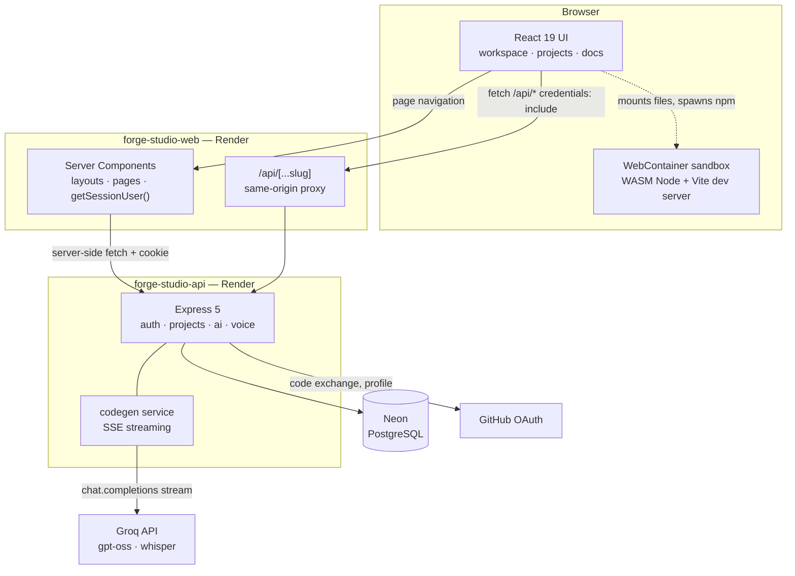
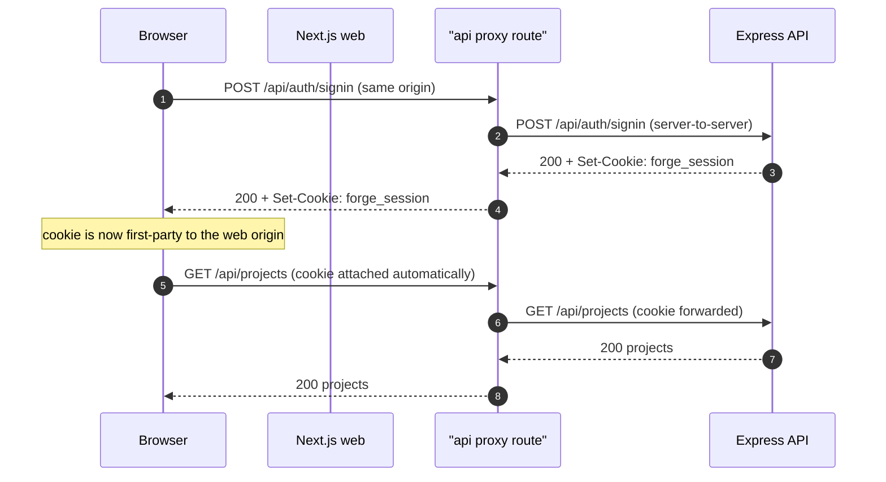
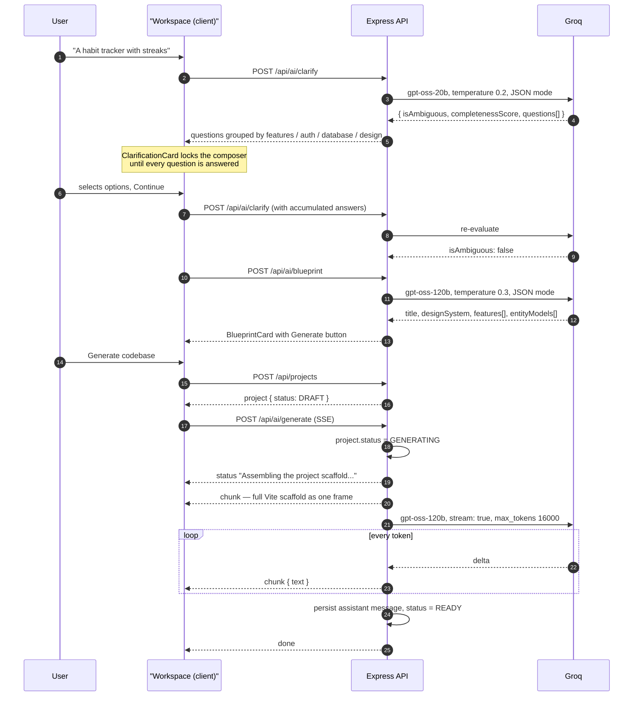
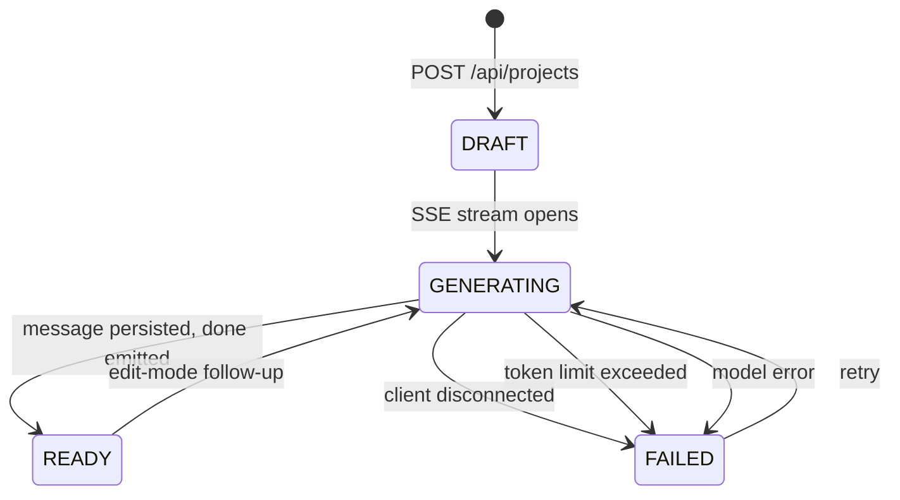
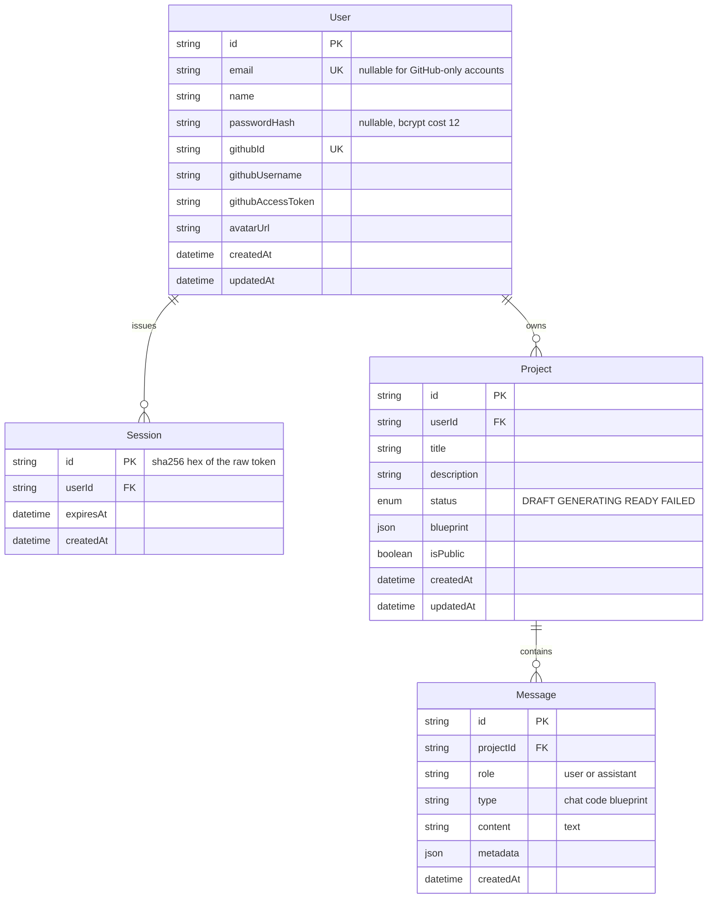

# Forge Studio

Describe an application in a sentence — or speak it — and Forge Studio clarifies the spec, designs a blueprint, generates a real Vite + React codebase, and runs it live in the browser.

It is a full-stack AI app builder, built as a monorepo: a **Next.js 16** front end and an **Express 5 + Prisma + PostgreSQL** backend, with generation streamed token-by-token from **Groq** and the preview executed client-side in a **WebContainer**.

---

## Table of contents

- [Architecture](#architecture)
- [Why the API is proxied through Next.js](#why-the-api-is-proxied-through-nextjs)
- [The generation pipeline](#the-generation-pipeline)
- [The streaming protocol](#the-streaming-protocol)
- [Project lifecycle](#project-lifecycle)
- [Data model](#data-model)
- [Authentication and sessions](#authentication-and-sessions)
- [The preview runtime](#the-preview-runtime)
- [Export](#export)
- [Repository layout](#repository-layout)
- [Running locally](#running-locally)
- [Deployment](#deployment)
- [Design decisions](#design-decisions)

---

## Architecture



Two services, one browser session. The front end never talks to the API service directly — every browser-originated request goes to the web service's own origin and is forwarded by a catch-all route handler behind it.

| Layer | Technology |
| --- | --- |
| Web | Next.js 16.3.5 (App Router, Turbopack), React 19.2.8, Tailwind CSS v4, Shiki, lucide-react |
| API | Express 5.2.1, Prisma 6.19.3, Zod 4, bcryptjs, express-rate-limit, TypeScript (ESM) |
| Database | PostgreSQL (Neon) |
| Models | Groq — `openai/gpt-oss-20b`, `openai/gpt-oss-120b`, `whisper-large-v3-turbo` |
| Preview | `@webcontainer/api` — a WebAssembly Node.js runtime running in the browser tab |

The model IDs carrying an `openai/` prefix are Groq's names for open-weight models served on Groq's inference platform. No OpenAI API is involved.

---

## Why the API is proxied through Next.js

The obvious deployment — put the Next.js app on one host and the Express API on another, and let the browser call the API directly — breaks authentication completely. The reason is a detail of how browsers scope cookies.

`onrender.com` is on the **Public Suffix List**. That list is what tells a browser which part of a hostname is a registrable domain, and its entries are treated like `com`, `co.uk`, or `github.io`: a shared suffix under which different owners live. For the browser, `forge-studio-web.onrender.com` and `forge-studio-api.onrender.com` are therefore **two different sites**, not two subdomains of one. A `SameSite=Lax` session cookie set by the API is not attached to requests made from the web app's origin. The cookie is written, and then never sent back.

That is not only a client-side problem. The Next.js layouts gate every page on a server-side session check, so the cookie also has to be readable while rendering on the server. A cross-site cookie breaks the redirect guards as well as the API calls.

The fix is to make every API call same-origin, and the cookie becomes first-party by construction:



`apps/web/src/app/api/[...slug]/route.ts` implements this with one `forward` function exported as `GET`, `POST`, `PUT`, `PATCH`, `DELETE`, `HEAD`, and `OPTIONS`. It is a transparent proxy, not a rewrite:

- **Request headers** pass through untouched except a hop-by-hop denylist (`connection`, `keep-alive`, `transfer-encoding`, `content-length`, `host`, and friends). The browser's `cookie` header reaches the API verbatim.
- **`x-forwarded-for`** is rewritten to the first hop only, so the API's rate limiter sees the real client IP rather than the web service's.
- **`redirect: "manual"`** is essential. Following redirects inside the proxy would swallow the OAuth 302 and its `location`; the handler forwards the 3xx to the browser intact.
- **The response body is streamed**, not buffered, which is what lets Server-Sent Events flow through without the proxy holding frames until completion.

A URL rewrite in `next.config.ts` would have been shorter, but it offers no hook to normalize `X-Forwarded-For` and gives no guarantee about SSE buffering — both of which matter here. A route handler keeps those decisions explicit.

The second, unrelated reason for cross-origin isolation sits on the same config: the preview sandbox needs `COOP`/`COEP` headers, described in [The preview runtime](#the-preview-runtime).

**Tooling consequence.** `API_URL` is read at *runtime* on the server and resolves to the absolute API origin, so server rendering can reach the API directly without a round trip through the proxy. In the browser it is deliberately the empty string, which makes every client-side request relative and therefore same-origin. Because it is not a `NEXT_PUBLIC_` variable, it is not inlined at build time — the same build artifact can be pointed at a different API by setting the variable on the host.

---

## The generation pipeline

Four model calls stand between a sentence and a running app. The first three are ordinary request/response JSON endpoints; the fourth streams.



**Stage 1 — Clarify** (`gpt-oss-20b`, temperature 0.2, JSON mode). A small, fast model scores the prompt against four axes: core features and workflows, database entities and relationships, auth and roles, and UI layout. A `completenessScore` below 75 with `isAmbiguous: true` returns 2–4 multiple-choice questions, each with 3–4 options and an optional free-text escape. The client allows at most three rounds, accumulating answers and re-submitting them as extra context.

**Stage 2 — Blueprint** (`gpt-oss-120b`, temperature 0.3, JSON mode). Returns a structured spec: title, description, target audience, a design system (primary color, `zinc`/`slate` neutral base, heading and body fonts, layout pattern), features, entity models with fields, and suggested packages. The system prompt carries explicit anti-slop constraints — Shadcn/Radix styling, a Zinc/Slate baseline, no neon gradients — which is what keeps generated UIs from converging on the same purple-gradient dashboard.

**Stage 3 — Generate** (`gpt-oss-120b`, temperature 0.2, streaming, `max_tokens: 16000`). This is the SSE endpoint, and where the token budget is enforced (see below).

**Voice input** is a separate two-model chain: `whisper-large-v3-turbo` transcribes with `language: "en"` and `temperature: 0`, then `gpt-oss-20b` at temperature 0.1 strips filler words while preserving intent. If the transcript comes back empty the refinement call is skipped entirely; if refinement returns nothing, the raw transcript is used as a fallback.

### Token budget management

Groq's free tier caps requests at 8,000 tokens per minute, which is smaller than what a full codebase plus its prompt can easily consume. Two mechanisms keep the pipeline inside that ceiling rather than failing opaquely:

1. **A pre-flight gate.** Prompt tokens are estimated at `length / 3.5`. If the estimate exceeds the model's per-minute allowance, the request is rejected with an error explaining the actual and allowed sizes, and the project is marked `FAILED` — no stream is opened and no tokens are spent.
2. **A mid-flight retry, in edit mode only.** If Groq returns a 413/429 token-limit error, the context builder re-runs in selection mode with a budget of 70% of the remaining room, narrowing the file set to just what the change needs, and the request is retried exactly once.

### Edit mode

Follow-up prompts do not regenerate the project. The client detects that files already exist and switches to `mode: "edit"`, sending the current file list. The server builds a context of the relevant files, instructs the model to re-emit only the files that change, and the client diffs the response against its previous state to report which paths were touched. Edit payloads are validated before use: at most 400 files totalling under 400,000 characters.

---

## The streaming protocol

`POST /api/ai/generate` responds with `text/event-stream` and frames in the standard EventSource wire format:

```
event: chunk
data: {"text":"<forgeAction type=\"file\" filePath=\"src/App.tsx\">"}

```

Four event names are emitted, each with a JSON payload:

| Event | Payload | Meaning |
| --- | --- | --- |
| `status` | `{ message }` | Human-readable progress line, shown beside the spinner |
| `chunk` | `{ text }` | A token of the artifact document |
| `error` | `{ message }` | Generation failed; already reflected in the status column |
| `done` | `{ message }` | Generation completed and the message was persisted |

A failed generation is **not** an HTTP error status. The response is a `200` carrying an `error` frame, because the stream has usually already started by the time anything goes wrong.

The client does not use `EventSource`. That API cannot send a JSON body or attach credentials the way this endpoint needs, so `streamGeneration` reads `res.body.getReader()`, decodes with a streaming `TextDecoder`, buffers, and splits on the `\n\n` frame separator itself.

### The artifact format

The model's entire output is one XML-ish document that the client parses incrementally:

```xml
<forgeArtifact id="app-build" title="Habit Tracker">
  <forgeAction type="file" filePath="src/App.tsx">
    ...file contents...
  </forgeAction>
  <forgeAction type="shell">npm run dev</forgeAction>
</forgeArtifact>
```

A deliberately chosen property of this format is that it is **parseable while incomplete**. A `<forgeAction>` whose closing tag has not arrived yet is still surfaced as a file with `complete: false`. That is what allows the file tree to fill in file-by-file during streaming, with the file currently being written marked by a pulsing dot and a `writing` badge, instead of the UI sitting blank until the last token lands.

Two normalizations run over every file body: `normalizeEscaping` un-escapes over-escaped backticks and `$` (a common failure when a model emits template literals inside XML), and `dedent` removes the common leading indentation so surrounding markup does not leak into the generated source.

### The scaffold

Every project starts from a fixed 7-file Vite + React + Tailwind v4 scaffold — `package.json`, `index.html`, `vite.config.ts`, `tsconfig.json`, `src/index.css`, `src/main.tsx`, `src/vite-env.d.ts` — generated server-side with the blueprint's primary color injected into the Tailwind theme tokens.

This scaffold is prepended to the stream and emitted as the **first** chunk, before the model produces anything. The model is then instructed never to emit those paths. Two things fall out of that arrangement: the client has a runnable project skeleton from the first frame, and the scaffold is permanently recorded inside the assistant message, which is what makes export complete without needing a separate snapshot field (see [Export](#export)).

The generated app is pinned to `<HashRouter>` rather than `BrowserRouter`, because the preview is served from a WebContainer URL where history-API routing has no server to fall back on.

---

## Project lifecycle



`GENERATING` is written only after the SSE headers have been flushed, so a client that connects and immediately drops does not strand a project in a state that implies work is happening. `READY` is written only after the assistant message row is committed — the status is never ahead of the data.

The abort path is wired end to end: the client's `AbortController` closes the connection, the server's `res.on("close")` handler flips an `aborted` flag and calls `controller.abort()` on the *same* signal passed to the Groq request, so the in-flight model call is genuinely cancelled rather than left to run to completion. The project is then marked `FAILED`, and no partial message row is written. `markFailed` swallows its own errors, so a failed status write can never take down the stream.

---

## Data model



Both `Project` and `Session` cascade on user delete, and `Message` cascades on project delete, so removing a user removes the entire graph in one statement. Every project-scoped query in the API is filtered by `userId` rather than fetching by id and checking ownership afterward — an unowned project is indistinguishable from a missing one.

The message log is the source of truth for a project's code. Three message types are stored: `chat` for conversation, `blueprint` for the spec card, and `code` for each generated artifact document. Reading a project back replays the `code` messages in order and re-parses them client-side.

---

## Authentication and sessions

Two ways in, one session model. Passwords are hashed with **bcrypt at cost 12**, and the schema keeps `email` and `passwordHash` nullable so a GitHub-only account is representable.

```mermaid
sequenceDiagram
  autonumber
  participant B as Browser
  participant A as Express API
  participant D as PostgreSQL
  participant G as GitHub

  rect rgb(30, 30, 38)
    Note over B,D: Session creation
    B->>A: POST /api/auth/signin
    A->>D: user by email (select passwordHash)
    A->>A: bcrypt.compare
    A->>A: randomBytes(32) -> base64url
    A->>D: INSERT Session { id: sha256(token), expiresAt: +30d }
    A-->>B: 200 + Set-Cookie forge_session (HttpOnly, SameSite=Lax)
    Note over D: the raw token is never stored
  end

  rect rgb(30, 30, 38)
    Note over B,G: GitHub OAuth
    B->>A: GET /api/auth/github?next=/workspace
    A-->>B: 302 to GitHub + state cookie (base64url of {state, next})
    B->>G: authorize (scope: read:user user:email)
    G-->>B: 302 to callback with code + state
    B->>A: GET /api/auth/github/callback
    A->>A: clear state cookie, timingSafeEqual(state)
    A->>G: exchange code for access_token
    A->>G: GET /user and /user/emails in parallel
    A->>D: upsert user by githubId
    A-->>B: 302 to /workspace + session cookie
  end
```



**Session tokens are opaque and stored hashed.** A 256-bit random token is generated with `crypto.randomBytes(32)`, sent to the client in an `HttpOnly`, `SameSite=Lax`, `Secure`-in-production cookie, and stored in the database only as its SHA-256 hex digest — which is the `Session.id` primary key. A database leak therefore yields no usable sessions. Expiry is enforced in application code on lookup: an expired session is deleted lazily and treated as absent, which avoids needing a scheduled sweeper.

**Sign-in is timing-safe.** When the email is unknown, or the account has no password hash, the service still runs a bcrypt comparison against a fixed dummy hash before returning failure, so response time does not reveal whether an account exists. The sign-up path additionally maps a unique-constraint violation to a `409` rather than leaking a raw database error.

**The OAuth state cookie carries the redirect target.** Rather than a random state value plus a separate redirect parameter, the `state` and the validated `next` path are packed into one base64url-encoded JSON cookie scoped to `path=/api/auth` and expiring in 10 minutes. The comparison uses `timingSafeEqual` behind a length check. Every failure mode has a distinct redirect code — `github_denied`, `github_state`, `github_email`, `github_linked`, `github_failed` — which the sign-in page renders as a specific message instead of a generic error.

**Account linking is explicit.** A GitHub sign-in whose verified email already belongs to a password account is refused rather than silently linked, and the user is told to sign in with their password. The `next` parameter passes through an open-redirect guard that rejects anything not a single-slash-prefixed absolute path, along with protocol-relative `//`, backslashes, and newlines.

### CSRF posture

A same-origin middleware guards every `/api` route. Safe methods pass through untouched; state-changing requests are rejected with `403` unless the `Origin` header matches the configured allowlist. This blocks cross-site form and fetch submissions from a browser. Requests with no `Origin` header at all — server-side clients, curl — are allowed through, which is what makes the Next.js server-side fetch path work, and is why the session cookie being `SameSite=Lax` is doing real work alongside it.

---

## The preview runtime

The preview is not a screenshot, a hosted iframe, or a simulated terminal. Generated projects run for real, inside the browser tab, in a **WebContainer** — a WebAssembly Node.js runtime that mounts the generated file tree, runs `npm install`, and starts a Vite dev server. The preview iframe points at the URL that dev server actually reports.

Three things have to line up for that to work:

**1. Cross-origin isolation.** WebContainers require `SharedArrayBuffer`, which browsers only expose to cross-origin-isolated pages. `next.config.ts` sets `Cross-Origin-Embedder-Policy: require-corp` and `Cross-Origin-Opener-Policy: same-origin` on every route, which is what makes `window.crossOriginIsolated === true`. Those headers are load-bearing, not hardening — and the UI is honest about it, surfacing `crossOriginIsolated` or `isolation unavailable` in the preview footer, and failing fast with an explanatory message when isolation is missing.

**2. A single long-lived container.** `WebContainer.boot()` is expensive, so a module-level singleton holds the instance and the in-flight boot promise, and a failed boot resets the promise so a retry is possible. The `server-ready` listener is attached exactly once and never detached.

**3. Race-condition defense.** The sandbox is a state machine — `idle → booting → mounting → installing → starting → ready | error` — and each run gets a monotonically increasing id. Every `await` is followed by a liveness check against the current id, so a slow run that has already been superseded cannot write state over a newer one. Each new run kills the previous dev process.

The file tree is validated before boot: a project missing `package.json`, `index.html`, `src/main.tsx`, or `src/App.tsx` is refused with a message naming the missing paths, rather than letting `npm install` fail with something less legible.

Code viewing uses **Shiki** with a lazily loaded highlighter: the core loads with no grammars, each language is dynamically imported on first use, and a revision counter discards results from stale async loads. Only the `github-dark-default` theme is bundled.

**State management** is deliberately thin. There is no global store, no query cache, and no client-side session fetch. The session user is read on the server in the layout and passed into a context whose value never changes; sign-in and sign-out call `router.refresh()` to re-run the server layout. Feature state lives in three co-located hooks — build session, generation, sandbox — composed in the workspace component and passed down as props.

During streaming, the parser runs on a throttle of 80ms rather than per token, and incoming text accumulates in a ref rather than state, so a fast stream does not cause a render per token.

---

## Export

`GET /api/projects/:id/export` returns a zip. The interesting part is where the code comes from.

There is no snapshot column. The export **replays the message log**: it folds `mergeFiles` over every `type: "code"` assistant message in order, with later messages overriding earlier files by path. Because the scaffold was embedded in the first message, the standard files reappear automatically, and an edit-mode history reconstructs exactly the final state of each file. If a change is made twice, the second wins — which is precisely the semantics of the edit flow.

Before writing, files are filtered for safety and size:

- Incomplete files (unclosed `<forgeAction>` blocks) are dropped and counted.
- Paths are validated against zip-slip: no absolute paths, no `..` segments, no backslashes, no drive letters, no NUL bytes.
- Per-file cap of 512 KB, total cap of 8 MB, and a 500-file ceiling.
- A `README.md` and `.gitignore` are synthesized when absent.

The zip is written by a **from-scratch implementation in `node:zlib`** — no `archiver` or `jszip` — emitting local file headers, a central directory, and an end-of-central-directory record, choosing stored versus deflate per entry based on which is smaller, with CRC-32 computed over the uncompressed bytes. Response headers report `X-Forge-Files` and `X-Forge-Skipped` so the client can tell the user how many files were written and how many were discarded.

---

## Repository layout

```
forge-studio/
├── apps/
│   ├── server/                    Express 5 API
│   │   ├── prisma/
│   │   │   ├── schema.prisma
│   │   │   └── migrations/        4 migrations, init -> ownership hardening
│   │   └── src/
│   │       ├── config/            env parsing, db, groq, github, cookie policy
│   │       ├── controllers/       thin HTTP layer
│   │       ├── middleware/        auth, same-origin guard, zod validation
│   │       ├── prompts/           system prompts and generation rules
│   │       ├── routes/            ai, auth, project, voice
│   │       ├── services/          business logic, incl. codegen and export
│   │       ├── templates/         the 7-file Vite scaffold
│   │       ├── types/             zod schemas, AI response shapes
│   │       ├── utils/             artifacts, cookies, tokens, zip, normalize
│   │       └── server.ts
│   └── web/                       Next.js 16 App Router
│       └── src/
│           ├── app/
│           │   ├── (app)/         workspace, projects — session-gated
│           │   ├── (auth)/        signin, signup — reverse-gated
│           │   ├── api/[...slug]/ the same-origin proxy
│           │   ├── docs/
│           │   └── globals.css    Tailwind v4 design tokens, no JS config
│           ├── components/        auth, ui primitives, workspace
│           ├── hooks/             build session, generation, sandbox, voice, shiki
│           └── lib/               api client, artifact parser, sandbox, session
└── render.yaml                    two-service deployment blueprint
```

The API follows a controller → service split, with Zod schemas as the boundary: validation middleware parses the body and *replaces* it with the parsed result, so coercion, defaults, and unknown-key stripping all happen once at the edge and nothing downstream re-checks types. `requireAuth` assigns `req.user`, and any route that reads it through `requireUserId` throws loudly if the middleware is missing — failing closed rather than operating on an undefined user.

---

## Running locally

```bash
npm install --prefix apps/server
npm install --prefix apps/web

npm run dev --prefix apps/server   # http://localhost:5000
npm run dev --prefix apps/web      # http://localhost:3000
```

`apps/server/.env`:

| Variable | Purpose |
| --- | --- |
| `DATABASE_URL` | PostgreSQL connection string |
| `GROQ_API_KEY` | Groq inference |
| `GITHUB_CLIENT_ID` / `GITHUB_CLIENT_SECRET` | OAuth app credentials; the GitHub routes report unavailability when unset |
| `GITHUB_CALLBACK_URL` | Must match the OAuth app's callback exactly |
| `WEB_APP_URL` | Where auth redirects land; also the default CORS origin |
| `CORS_ORIGINS` | Comma-separated allowlist, overrides `WEB_APP_URL` |
| `TRUST_PROXY` | Proxy hops to trust — see below |
| `API_PORT` / `PORT` | Defaults to 5000 |

`apps/web/.env.local`:

| Variable | Purpose |
| --- | --- |
| `API_URL` | Absolute origin of the API for server-side rendering. Leave unset locally to default to `http://localhost:5000`. In the browser it resolves to the empty string, so all client requests stay same-origin. |

Database schema is applied with `npx prisma migrate deploy` (or `migrate dev` while changing it) from `apps/server`.

---

## Deployment

`render.yaml` defines both services as a blueprint: Node runtime, free plan, `ohio`, auto-deploy from `main`, each rooted at its app directory.

The API's build runs `prisma generate` and `prisma migrate deploy` before compiling, so schema changes ship with the code that needs them. Both builds pass `--include=dev`, because `NODE_ENV=production` otherwise omits the dev dependencies the build itself requires — the TypeScript compiler, the Prisma CLI, and the Tailwind PostCSS plugin are all build-time tools.

### Why `TRUST_PROXY=2`

Express derives `req.ip` from `X-Forwarded-For` using a hop-count rule: the address list is the socket peer followed by the header entries in reverse, and trusting *n* means taking the nth entry. The deployed request path adds two proxy hops beyond the browser:

```
browser → Render LB (web) → Next.js → Render LB (api) → Express
```

so the API sees `X-Forwarded-For: <real client>, <web service>` with a Render load balancer as the socket peer. Trusting 2 hops lands `req.ip` on the real client. This matters because the credential rate limiter keys on `req.ip` — too low and one client's attempts can throttle another's, too high and the header becomes spoofable. It is verifiable after deploy by comparing the `pk=` partition key in the `RateLimit-Policy` response header from two different networks: it should differ.

### Environment contract between the services

`API_URL` on the web service points at the API service, and `WEB_APP_URL` on the API points back at the web service. `GITHUB_CALLBACK_URL` must be the **web** service's callback path (`https://<web-host>/api/auth/github/callback`), since the browser is redirected there — and must match the value configured in the GitHub OAuth app. Secrets (`DATABASE_URL`, `GROQ_API_KEY`, the GitHub pair) are marked `sync: false` and are entered in the dashboard, never in the repository.

---

## Design decisions

**One route handler instead of a rewrite.** More code, but it keeps control over the two things that would otherwise be guesses: the client IP the rate limiter sees, and whether SSE frames are buffered.

**The scaffold ships with the message.** Prepending the fixed scaffold to the first streamed chunk costs a few hundred tokens per generation and buys two things — an immediately runnable project in the UI, and an export that reconstructs itself from the conversation log with no snapshot column to keep in sync.

**Streaming is hand-parsed.** `EventSource` cannot POST a body or carry credentials the way this endpoint needs, so the SSE format is parsed from a `ReadableStream` directly. Slightly more code than the browser API, and the only option that fits the requirements.

**Session tokens are hashed at rest.** Storing the digest as the primary key costs one hash per request and means a database read does not yield a usable session.

**Rate limiting is applied narrowly.** Only sign-up, sign-in, and OAuth start are limited — the endpoints where guessing is the threat. The heavier AI and export routes are currently unmetered, which is the main gap in the current security posture and the next thing to address, along with per-user generation quotas.

**Dependency-light by choice.** The zip writer is built on `node:zlib`, the artifact parser is a few dozen lines of regex, `cn` is a three-line join rather than `clsx` plus `tailwind-merge`, and the UI primitives are hand-rolled rather than imported from a component library. Some of this is deliberate — a custom zip writer and an incremental artifact parser are the interesting parts of the problem — and some is the usual tradeoff of owning the code that the app's behaviour depends on.

---

Built with Next.js, Express, Prisma, PostgreSQL, Groq, and WebContainers.
